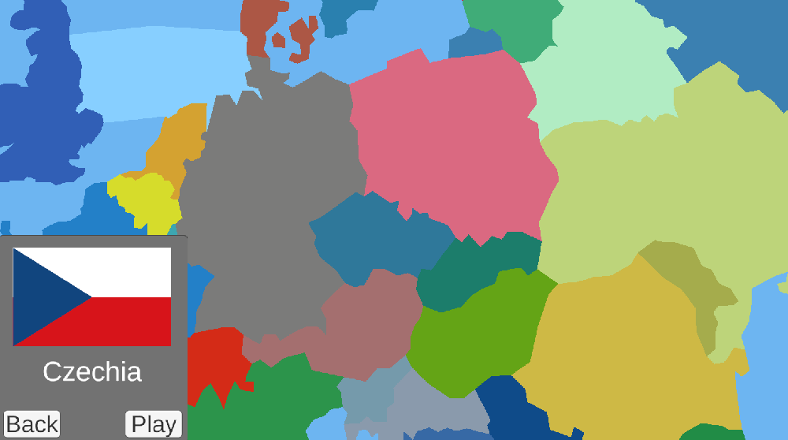
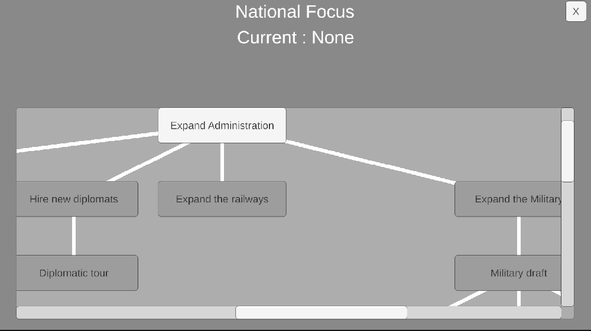
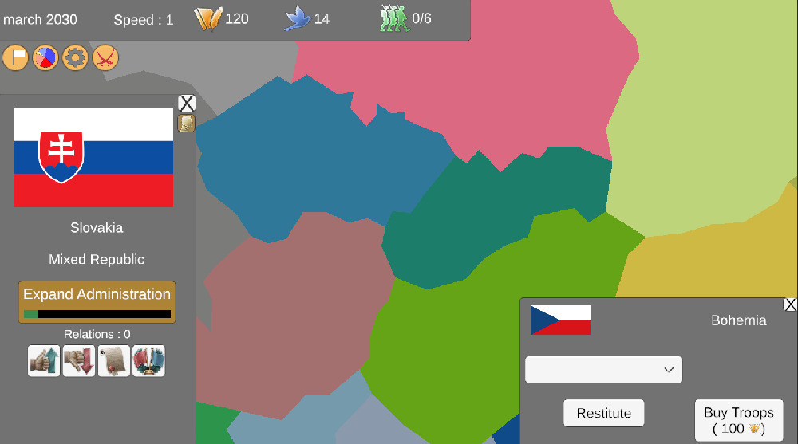
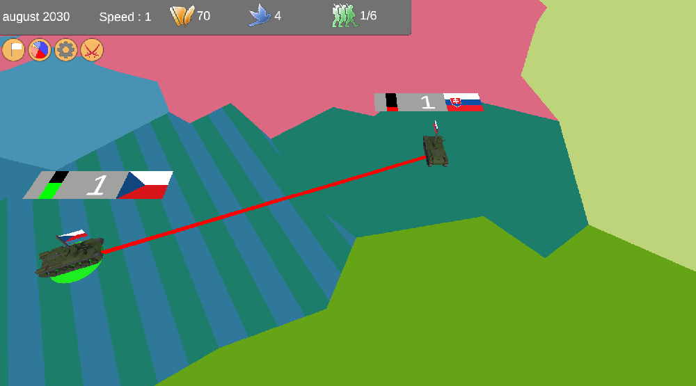

# GSG - Europe

**GSG - Europe is a Unity 3D strategy game that is currently in developpement.**

## Technologies used
- Unity Engine
- C#

## Description
This game is a sandbox in which you can expand your country by attacking or allying your neighbors. There are numerous things you can do :
- Customize your country, by electing different political parties, or by changing your type of governement. (Republic, Monarchy, ...)
- Engage in diplomatic relations with your neighbors, or invade them.
- Form a federation with other countries, then unify it.
- Form a long gone country by controlling all the required provinces, such as Rome, or the Soviet Union.
- Go down your focus tree, to unlock new abilities and upgrades.

The map is generated from a .json file, created using a custom editor made in python. This tool allows to modify the map more easily, and to setup the different countries on the map.

The game is still being worked on, and new / revamped features are added from time to time. The first iteration of the game dates from 2020-2021.

## Screenshots

## Links

<a href="https://helisoya.itch.io/gsg-europe">Itch.io page</a>
